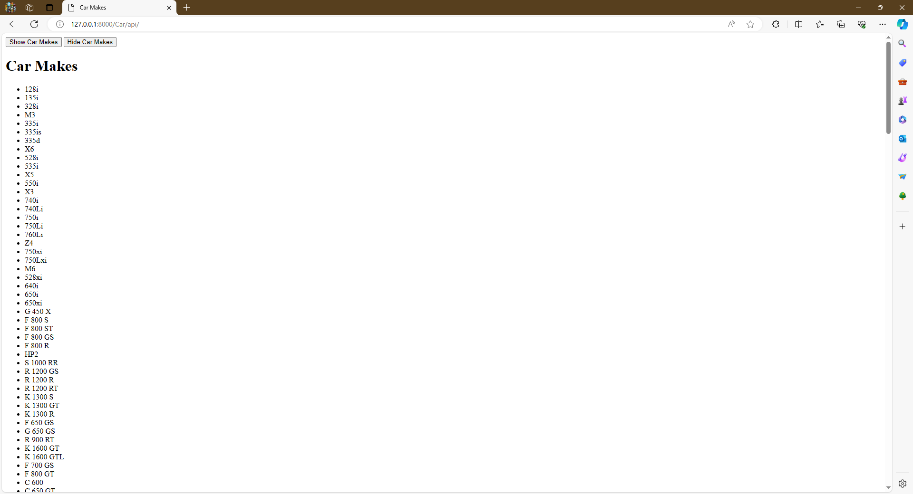

# Live Project

## Introduction

During my Software developer course at The Tech Academy, I took place in a live project where I worked with other students to build apps for a website called AppBuilder9000.  During this course I learned how a real development team might work, from project management, version control and client stories. the project used the Django framework and consisted of both front and back end work.  Mainly using languages such as HTML, CSS, SQLITE, Python and some JavaScript.  I chose to build an app that was centered around cars and completed many stories that I am quite proud of.  

## Back End Stories

* Create Your Model
* Edit and Delete Functions

During the Create Your Model story I was tasked with creating a model and then a model form which saves the users inputs into a database.  I then created a views function which would allow me to render the form on my create template.

The edit and delete Functions story comprised mainly of adding buttons to my details template that allow a user to select an entry from the database and chose to edit or delete that entry.  I built a views function that renders a new page for viewing any selected entry from the database.  I then added both edit and delete buttons via a modal using javascript.

### Form Page Snippet

### Form model Snippet

###  Edit And Delete Snippet

### Edit And Delete Confirmation Snippet

### Edit And Delete Modal JS Snippet

### Edit And Delete Snippet

## Front End Stories

* Display Items in Database
* Build the Basic App

The Display Items in Database story tasked me with creating a new html template that would gather all of my items in the database and present them in an organized manner.  I was really able to put my CSS skills to the test here.

The Build the Basic App story tasked me with building the base for my mainapp, this included the creation of the mainapp using python terminal commands (python manage.py startapp), then creating the base and home templates.  As well as creating a function to render the home page.  I poured many hours of styling into this and the rest of the templates and am quite happy with the outcome.

## Snippets of My App

### Link to Car App

### Home Page

### Create Page

### Database List Page

### Details Page

### Api

### Beautiful Soup

